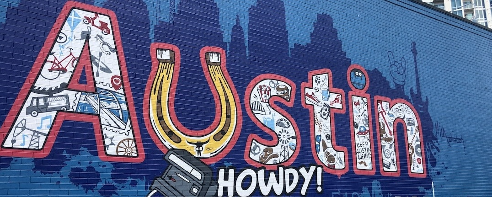

# Overview

I'm an experienced technical writer, information architect, team leader, and user experience professional in software development. In my roles, I'm a passionate advocate for users and for the design, development, and delivery of quality technical content. 

> My focus is on the "information experience" of a software application, inside and outside of its user interface. Because technical content is a key part of the user journey, I feel its development is integral to any project. I rely on a **user-centered approach**, information plans, and detailed metrics to help design, develop, and measure the effectiveness and impact of the content that I write.

Great documentation, help, and in-app assistance provide users with the answers that they're looking for, when and where they need it, and with the right amount of detail. I'd love the opportunity to add my commitment, desire for continual improvement, and experience working on complex software to your technical writing team.

## Experience

* **30+ years** as a technical writer that includes planning, writing, updating, and editing technical documentation, user assistance, UX designs, websites, and social media.
* **15+ years** as the team lead for a group of domestic and international writers.
* **13+ years** as an information architect for enterprise-class, software applications.
* Detailed-oriented writer with proven skills in managing large volumes of information and multitasking in an agile, deadline-driven environment.
* Strong communication and organization skills. Experience collaborating with developers, DevOps, editors, engineers, marketing, product architects, product managers, QA, technical support, translators, sales, UX designers, and other key stakeholders.

<a href="Chris-King-Resume-2023.pdf" target="_blank">Download the PDF version of my resume.</a> 

## Contact information

Chris King  
[Cedar Park]("Cedar Park is a suburb of Austin with a population of 74,741."), TX <!-- 78613 --> 
<!-- 1905 Clay Ln -->
<!-- 512.517.1812 -->

Email: <ck9252@gmail.com>  
LinkedIn: <a href="https://www.linkedin.com/in/chris-king-b2475b8/" target="_blank">https://www.linkedin.com/in/chris-king-b2475b8/</a>  
Twitter: <a href="https://twitter.com/Chris_TKing" target="_blank">https://twitter.com/Chris_TKing</a>

## Education

B.A., English \(with emphasis on Technical Writing)  
Northern Illinois University