# Professional resources and reference information

View my personal writing tips, resources, and quick reference information.

## UX writing guidelines

!!! note "My approach to UX writing"

    UX writing informs users about actions they can take, are taking, or have just taken, guides them through the user flows, and increases their confidence. **My focus when writing UX copy is to deliver the right information to the right person at the right time and in the right place.**

    Good UX writing can reduce the size of technical documentation, and in some cases, eliminate it. 

View the tips that I follow when I edit UX designs for software applications.

UI element        | Guideline                          
----------------- | ------------------------------------ 
Buttons           | Use verbs that match the action. Avoid the word "submit" when a more specific word better describes the action.
Capitalization    | Use sentence-style capitalization for headings and labels. Consistency is key.
Inline text       | - Begin with the objective (lead with the benefit). - Keep sentences to 25 words or less. - Keep paragraphs to 3 lines or less. - Begin the first sentence with an imperative, when possible. - Avoid action words like "click" or "press" when that action is implied by the appearance / context of the UI element. - Keep the copy consistent. - Avoid jargon. - Avoid the and/or conjunction. The "and/or" conjunction is forbidden in Strunk and White: The Elements of Style. - Avoid using long noun phrases. Limit a noun phrase to no more than three words.
Hover help        | - Keep to 32 words or less. 64 words max. - Keep to 3 sentences or less. - Begin "what is" text with a definite article. - Focus on one topic. - Splitting infinitives and ending on prepositions is ok -- if they save you a word.
Point of view     | Use the second person. As much as possible, use the second person, which is indicated by the personal pronoun "you". The second person focuses on the reader. Avoid using pronouns like I, we, and us, and nouns like "the user".
Tense             | Write in the present tense.
Voice             | Use active voice. Exception: In cases where the user failed or did something wrong, you can soften the wording by using passive voice.

## Hover help guidelines

What is hover help? Hover help is text that is displayed when users hover over an element in the GUI.

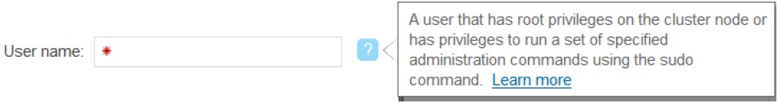

What hover help is | What hover help isn't                          
-----------------  | ------------------------------------ 
Hover help answers the following questions for users: - What do I enter? - What's this? - How do I determine the right value? | - A method for explaining how to complete a complex task. - Longer than 64 words (optimally 32 or less). - Intended to replace contextual help or Knowledge Center content. - A way to warn users that an invalid value was entered in a field. - A repetition of a GUI label. - A replacement for good design. - Hover help is different from a “tool tip”, which is used for validating user input in a text field.

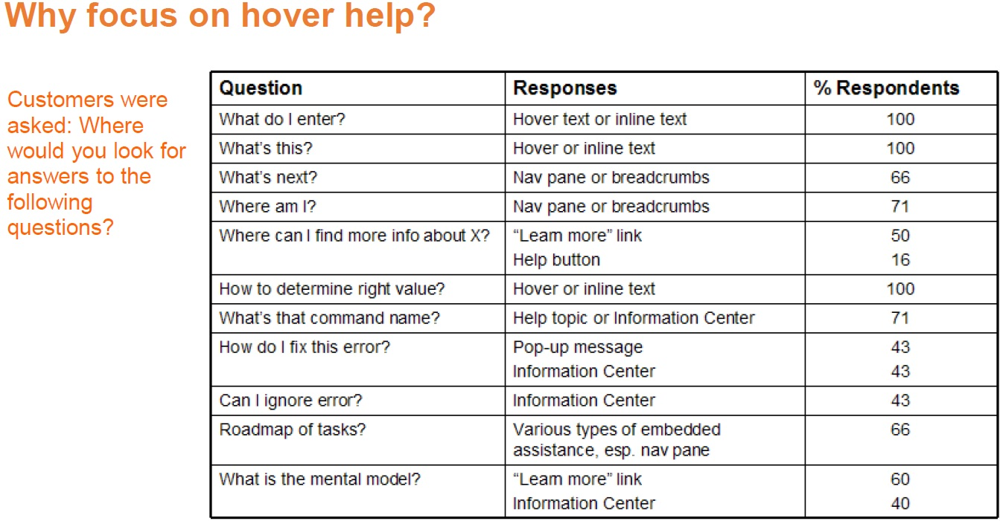

### Writing hover help

Do        | Key guidelines | Do not                        
----------| ---------------|------------- 
- Be meaningful and helpful; don't just repeat the label. - Be concise (32 words or less). - Use plain English. - Start with a definite article (the). Leverage the context. - Provide recommendations for the labels. - Make sure the values that are shown in the cells or fields are easy to understand. | Add hover help when:  - A label does not sufficiently explain the purpose of a GUI element. - A label sufficiently explains the purpose of a GUI element, but there are special circumstances, restrictions, limitations, or tips that might help users better understand it. | - Add when you don't need it: "Name, ID, Unique ID..." - Repeat what the label already says: "The name of the storage system." - Say what is shown: "Shows whether tiering is on or off" - Say what it isn’t: "If you don't have Easy Tier, you won't see any values" - List the valid values for the field: "The status values for ABC are OK, Error, Offline, Inactive" - Refer to the product name

## Examples of technical writing feedback on UX designs

View examples of feedback that I provided to UX designers for new features in a SaaS application and in an on-premise element manager for a storage system.

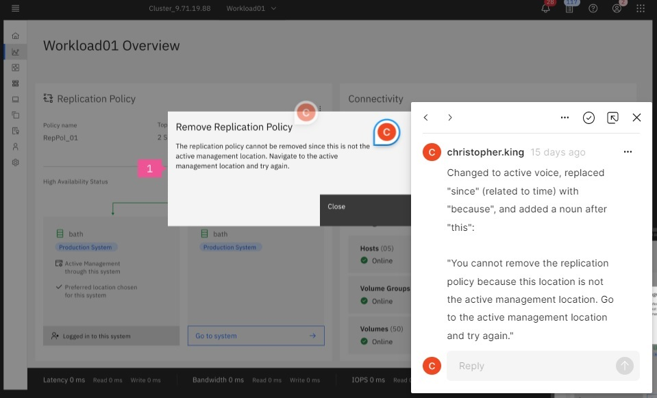

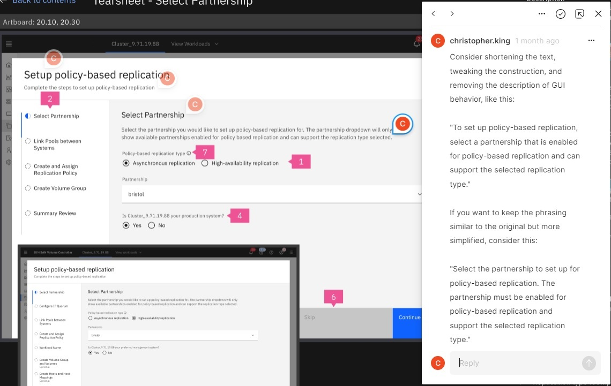

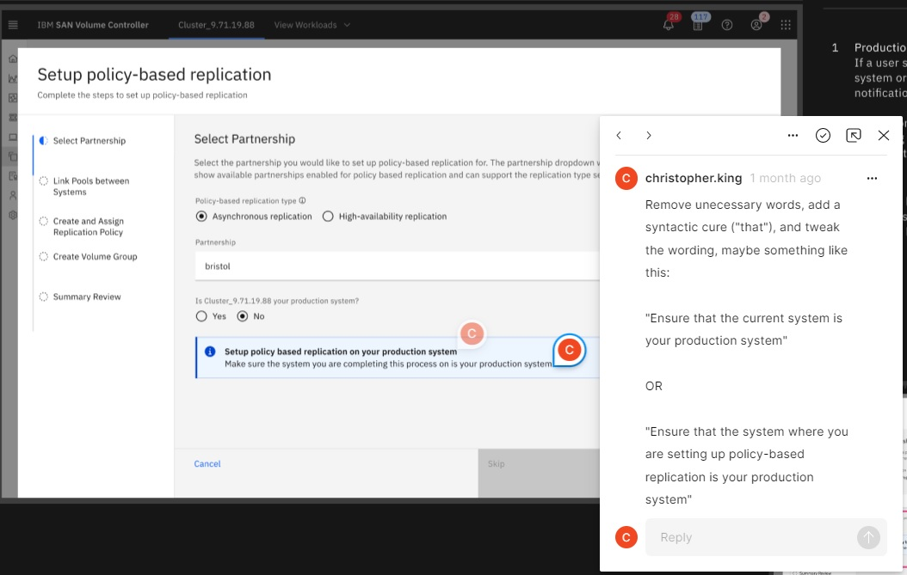

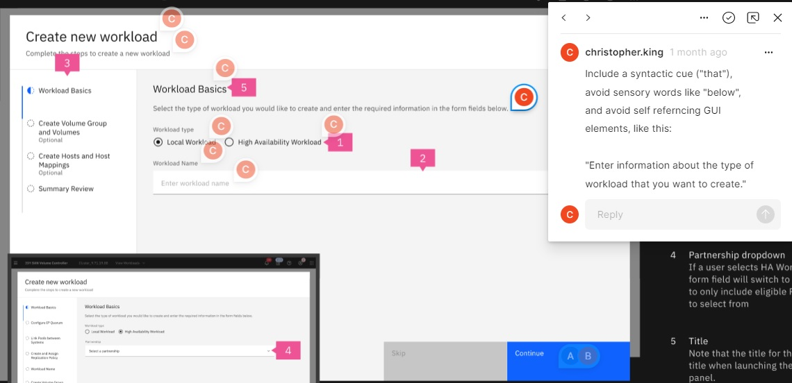

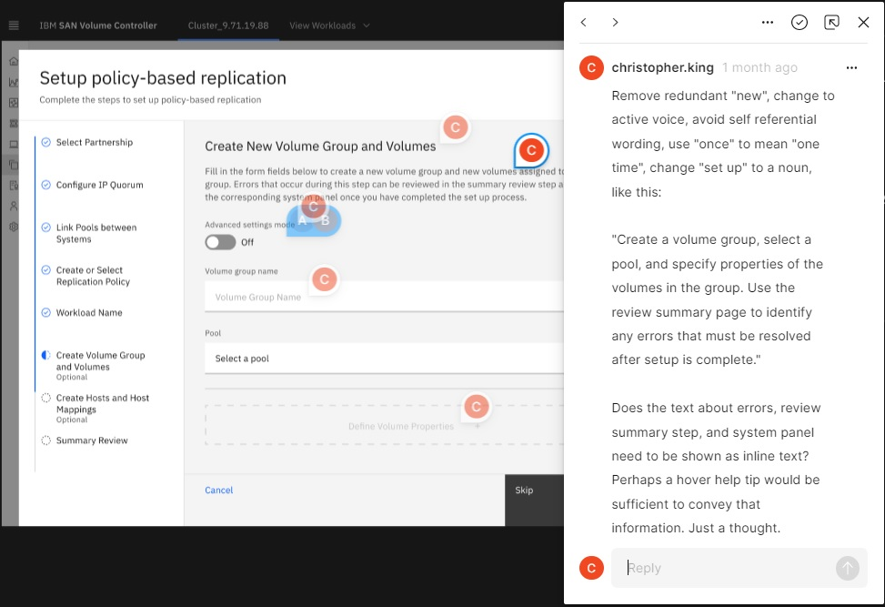

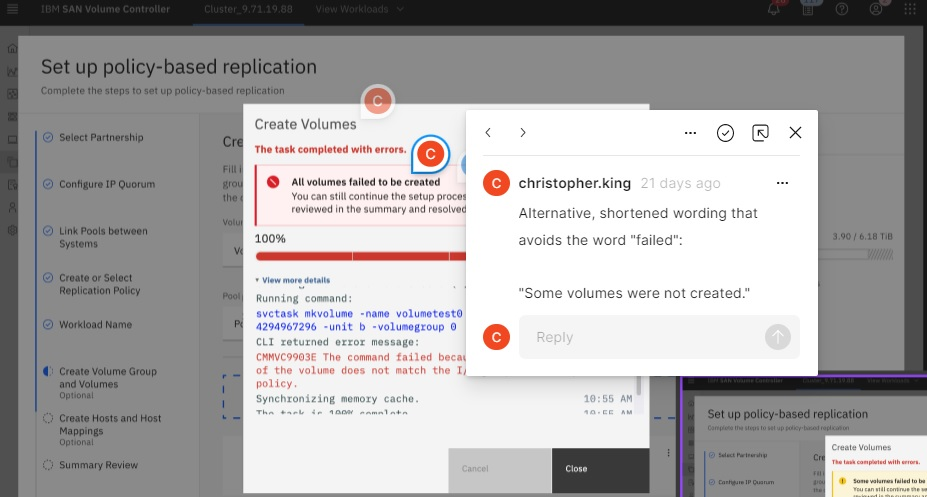

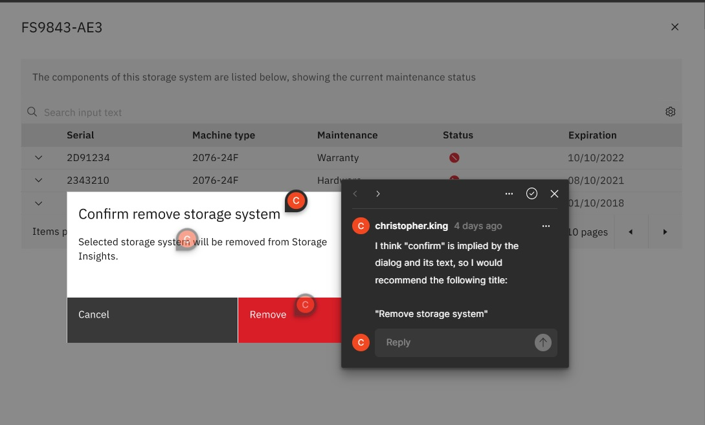

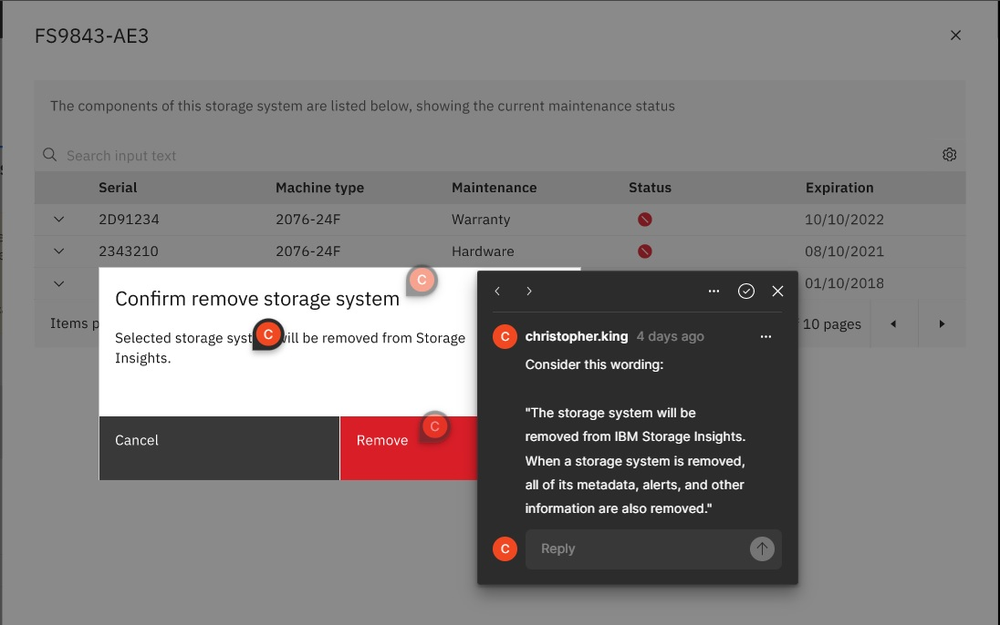

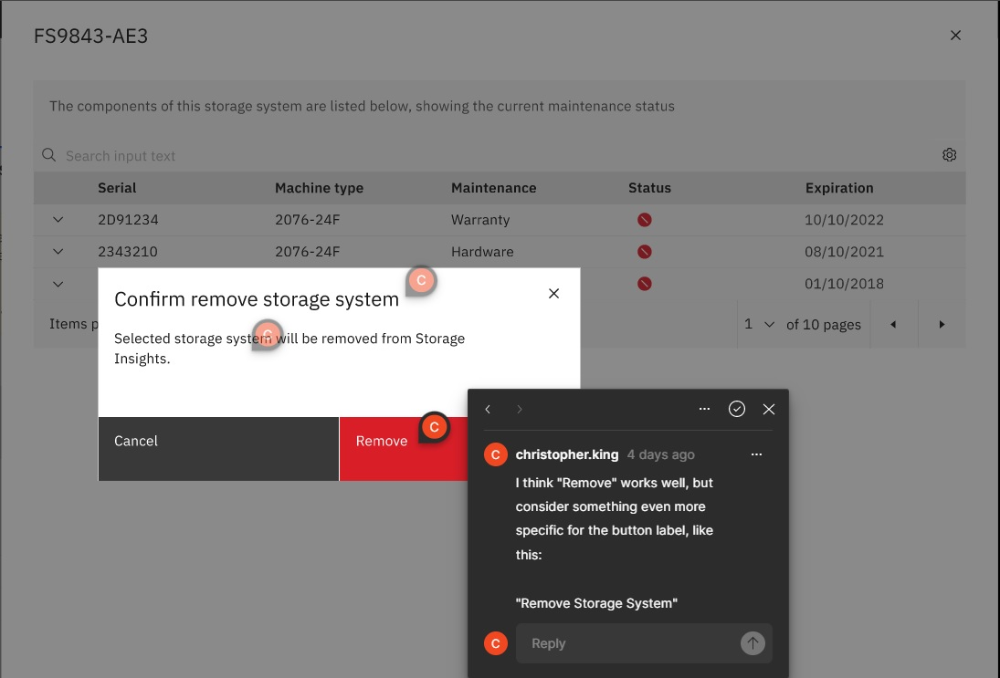

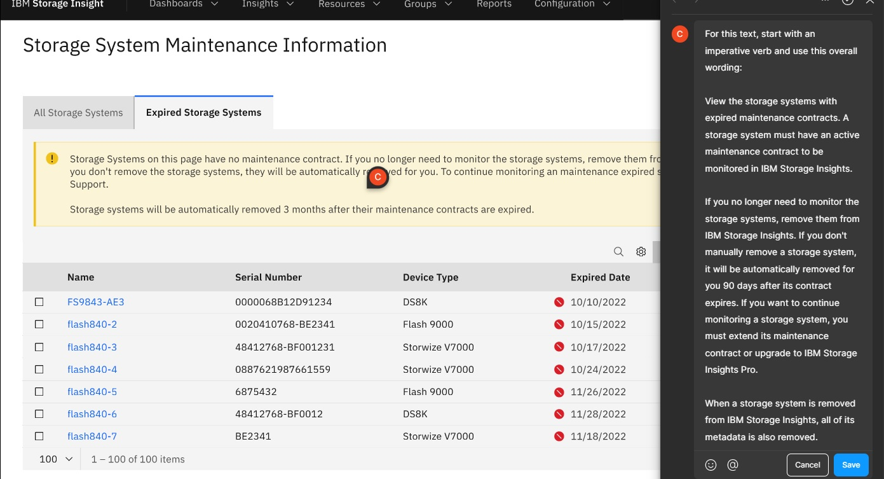

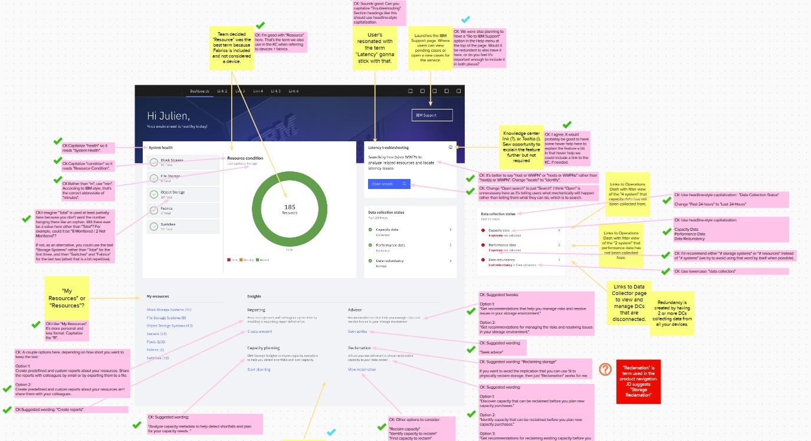

View the short, WalkMe guided tour (walkthru) that I designed, wrote, and helped implement in a SaaS application at IBM.
[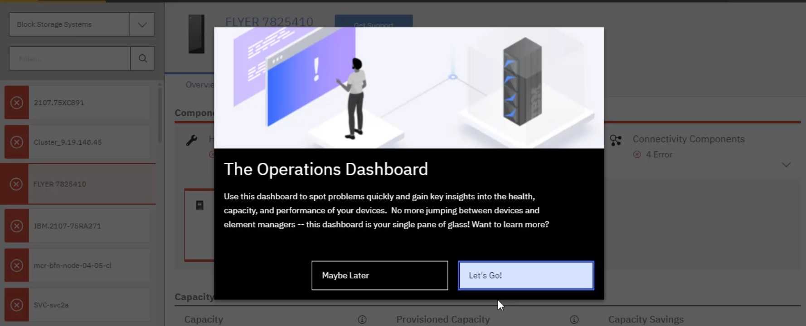](images/WalkMe-walkthru.mp4)

## Resources

* Carbon
    * [https://carbondesignsystem.com/](https://carbondesignsystem.com/)
    * Markdown: [https://gatsby-theme-carbon.vercel.app/components/markdown/](https://gatsby-theme-carbon.vercel.app/components/markdown/)
* [Markdown](https://www.markdownguide.org/getting-started/#how-does-it-work)
    * MKdocs: [https://www.mkdocs.org/getting-started/](https://www.mkdocs.org/getting-started/)
    * Markdown cheat sheet: [https://www.markdownguide.org/cheat-sheet/](https://www.markdownguide.org/cheat-sheet/)
* Visual studio extensions: [https://www.makeuseof.com/vscode-ultimate-markdown-editor/](https://www.makeuseof.com/vscode-ultimate-markdown-editor/)
* Material for MkDocs
    * [https://squidfunk.github.io/mkdocs-material/](https://squidfunk.github.io/mkdocs-material/)
    * [https://squidfunk.github.io/mkdocs-material/getting-started/](https://squidfunk.github.io/mkdocs-material/getting-started/)
    * [https://www.youtube.com/watch?v=Q-YA_dA8C201](https://www.youtube.com/watch?v=Q-YA_dA8C201)
    * [https://github.com/james-willett/mkdocs-material-youtube-tutorial/tree/main](https://github.com/james-willett/mkdocs-material-youtube-tutorial/tree/main)

## Glossary

| Term        | Description                          |
| ----------- | ------------------------------------ |
| Blockchain  | A blockchain is a distributed database or ledger shared among a computer network's nodes. They are best known for their crucial role in cryptocurrency systems for maintaining a secure and decentralized record of transactions, but they are not limited to cryptocurrency uses. Blockchain is a record-keeping technology designed to make it impossible to hack the system or forge the data stored on it, thereby making it secure and immutable. It is a type of distributed ledger technology (DLT), a digital system for recording transactions and related data in multiple places at the same time.
| Blockchain security | Blockchain is based on principles of cryptography, decentralization and consensus, which ensure trust in transactions. In most blockchains or distributed ledger technologies (DLT), the data is structured into blocks and each block contains a transaction or bundle of transactions. Each new block connects to all the blocks before it in a cryptographic chain in such a way that it's nearly impossible to tamper with. All transactions within the blocks are validated and agreed upon by a consensus mechanism, ensuring that each transaction is true and correct. |
| Container    | A container is a process or group of processes isolated from other programs on a shared kernel. A kernel is a computer program at the core of a computer’s operating system (OS) and generally has complete control over everything in the system. Containers are a guest OS with virtual resources. |
| Converged Infrastructure | A bundling of compute, storage and networking systems. It is not an actual technology, but rather a packaging of traditional technologies that offers customers a turnkey, or "right-sized," data center solution. Converged infrastructure is a pre-packaged bundle of systems, including servers, storage, networking, and management software. |
|  Distributed ledger technology (DLT) | The technological infrastructure and protocols that allow simultaneous access, validation, and record updating across a networked database. Various types of distributed ledger technology are currently in use. Blockchain, which bundles transactions into blocks that are chained together, and then broadcasts them to the nodes in the network, is the best-known type of DLT. |
| Docker      | Docker is a software platform that allows you to build, test, and deploy applications quickly. Docker packages software into standardized units called containers that have everything the software needs to run including libraries, system tools, code, and runtime.  |
| Jekyll | A static site generator that takes Markdown files and converts them to a website. Jekyll is a free and open-source application written in the Ruby programming language. |
| Kurbenetes  | Docker is a containerization platform and runtime and Kubernetes is a platform for running and managing containers from many container runtimes. Kubernetes supports numerous container runtimes, including Docker. |
| Virtual Appliance  | Considered a software equivalent of a hardware device, a virtual appliance (VA) is a preconfigured software solution. It contains an operating system (OS) and a customized application to perform a fixed set of functions. |
| Zero trust | A security framework requiring all users, whether in or outside the organization's network, to be authenticated, authorized, and continuously validated for security configuration and posture before being granted or keeping access to applications and data.